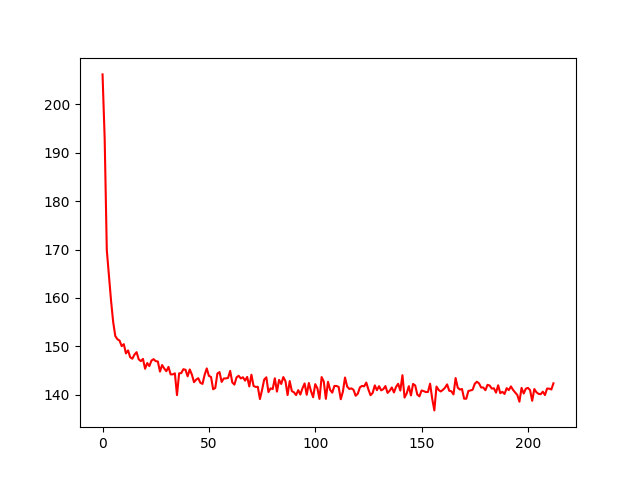
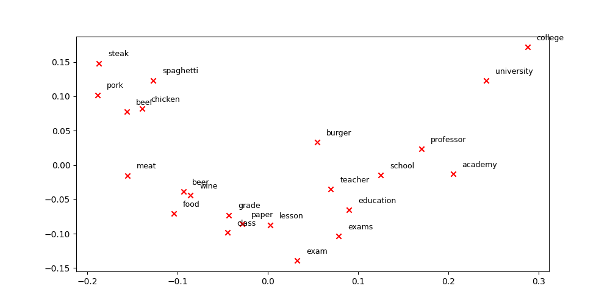
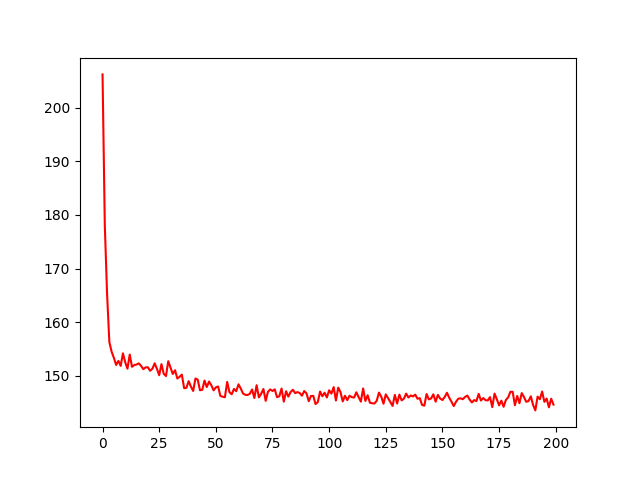
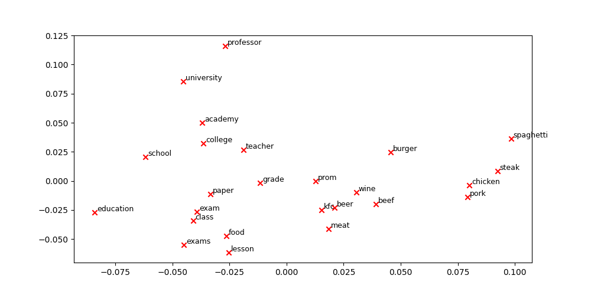

## text8 上的训练结果

使用如下参数：

```angular2html
vocab_max_size = 30000
layer1_size = 100
window = 10
b_size = 240
num_epochs = 5
learn_rate = 0.0001
```






## google news 选出24M个词的训练结果





参数和结果

```angular2html
vocab_max_size = 30000
layer1_size = 300
window = 10
b_size = 240
num_epochs = 5
learn_rate = 0.0001
text_size = 24000000

capital-common-countries accuracy:  21.21 % ( 98 , 462 )
capital-world accuracy:  8.97 % ( 102 , 1137 )
currency accuracy:  5.56 % ( 3 , 54 )
city-in-state accuracy:  4.55 % ( 66 , 1452 )
family accuracy:  38.10 % ( 160 , 420 )
gram1-adjective-to-adverb accuracy:  2.58 % ( 24 , 930 )
gram2-opposite accuracy:  3.25 % ( 15 , 462 )
gram3-comparative accuracy:  16.14 % ( 215 , 1332 )
gram4-superlative accuracy:  10.69 % ( 93 , 870 )
gram5-present-participle accuracy:  8.28 % ( 72 , 870 )
gram6-nationality-adjective accuracy:  22.69 % ( 248 , 1093 )
gram7-past-tense accuracy:  12.96 % ( 192 , 1482 )
gram8-plural accuracy:  8.71 % ( 92 , 1056 )
gram9-plural-verbs accuracy:  5.23 % ( 34 , 650 )

all accuracy:  11.52 % ( 12270 , 1414 )

语义任务的accuracy 469/3651  0.128
```

词向量维度600

